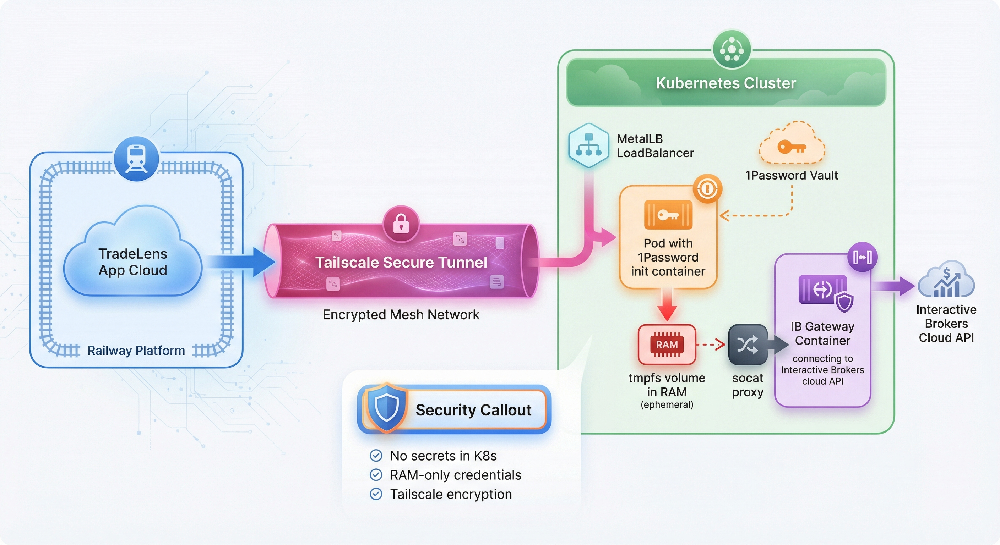

# IB Gateway - Interactive Brokers API

Runs IB Gateway in a container with secure credential handling via 1Password.

## Architecture



## Security Model

Credentials are **never stored in Kubernetes** — they're fetched from 1Password at pod startup and exist only in memory (tmpfs).

**Security Flow:**
1. Init container fetches credentials from 1Password vault (encrypted at rest)
2. Credentials written to tmpfs volume (RAM only, never persisted to disk)
3. IB Gateway container reads credentials from tmpfs
4. On pod restart/deletion, tmpfs is wiped (credentials never survive)

## Prerequisites

### 1. Create IBKR credentials in 1Password

Create an item in your 1Password `K8S` vault:

- **Item name:** `IBKR`
- **Fields:**
  - `username` - Your IBKR username
  - `password` - Your IBKR password
  - `trading_mode` - `paper` or `live`

### 2. Create the 1Password Service Account token secret

The only secret stored in k8s is the 1Password service account token (which can only read, not modify, your vault).

```bash
# Create the secret (run once)
kubectl create secret generic op-service-account \
  --from-literal=token="$(op read 'op://K8S/OP-Service-Account/credential')" \
  --namespace=default
```

Or use Sealed Secrets:
```bash
kubectl create secret generic op-service-account \
  --from-literal=token="YOUR_TOKEN" \
  --dry-run=client -o yaml | \
  kubeseal --format yaml > op-service-account-sealed.yaml
```

## Deployment

```bash
kubectl apply -f apps/ib-gateway/
```

## Ports

| Port | Internal | Description |
|------|----------|-------------|
| 4001 | 4001 | Live trading API |
| 4002 | 4002 | Paper trading API |
| 5900 | 5900 | VNC (optional, for debugging) |

## Environment Variables

| Variable | Description | Default |
|----------|-------------|---------|
| `TRADING_MODE` | `paper` or `live` | `paper` |
| `READ_ONLY_API` | API read-only mode | `true` |
| `TWS_ACCEPT_INCOMING` | Accept remote connections | `true` |
| `VNC_SERVER_PASSWORD` | VNC password (optional) | (none) |

## Troubleshooting

### Check if credentials are being fetched
```bash
kubectl logs <pod-name> -c fetch-secrets
```

### Check IB Gateway logs
```bash
kubectl logs <pod-name> -c ib-gateway
```

### VNC access for debugging
```bash
kubectl port-forward <pod-name> 5900:5900
# Then connect with VNC client to localhost:5900
```
