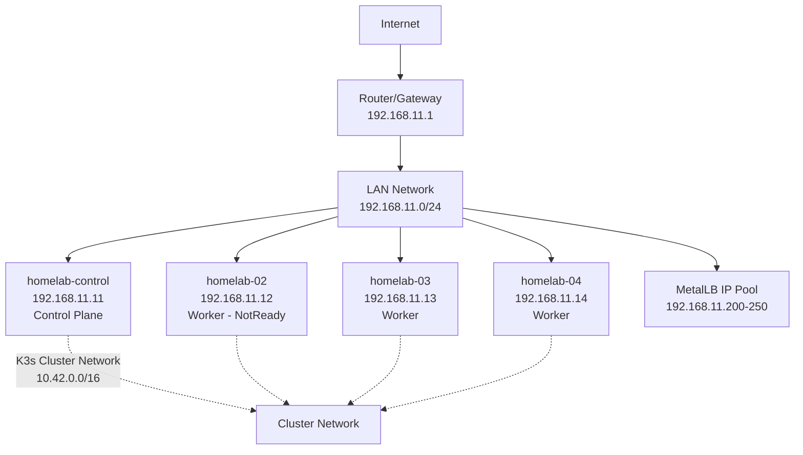
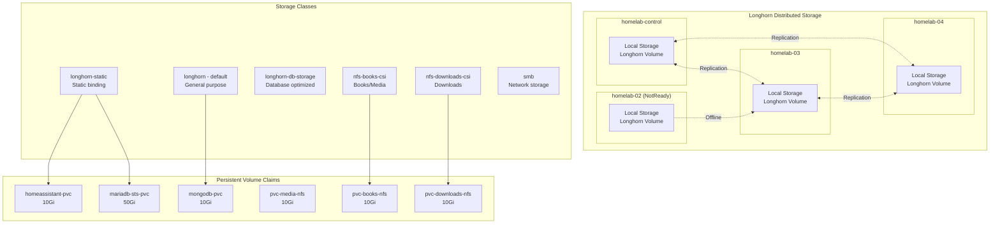
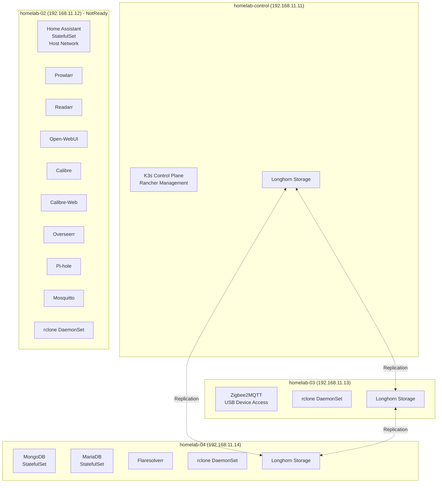
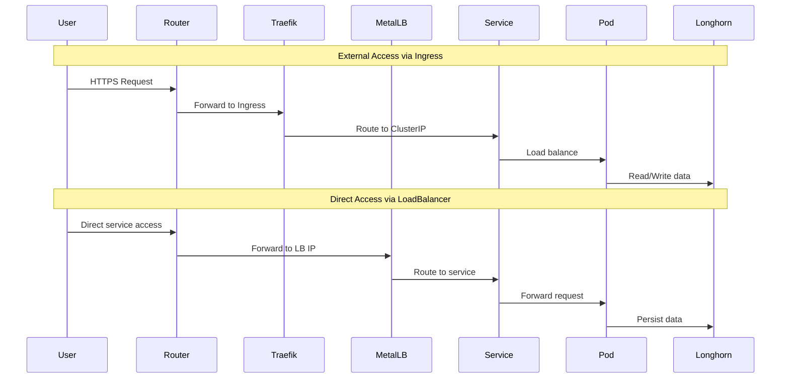

# K3s Homelab Network Diagram

## Physical Network Topology

## Kubernetes Service Architecture

```mermaid
graph TB
    subgraph "External Access"
        Internet2[Internet]
        Router2[Router]
        Traefik[Traefik Ingress<br/>SSL/TLS + Cert-Manager]
    end
    
    subgraph "MetalLB LoadBalancer Services"
        HA[Home Assistant<br/>192.168.11.207:8123]
        Unifi[Unifi Controller<br/>192.168.11.205:8080/8443]
        Z2M[Zigbee2MQTT<br/>192.168.11.206:8080]
        Pihole[Pi-hole DNS<br/>192.168.11.222:53]
        Maria[MariaDB<br/>192.168.11.203:3306]
        Overseer[Overseerr<br/>192.168.11.202:5055]
        Calibre[Calibre<br/>192.168.11.209:8080]
        CalibreWeb[Calibre-Web<br/>192.168.11.210:8083]
        MQTT[Mosquitto MQTT<br/>192.168.11.230:8883]
        Zurg[Zurg<br/>192.168.11.208:9999]
    end
    
    subgraph "ClusterIP Services"
        Prowlarr[Prowlarr]
        Sonarr[Sonarr]
        RDT[RDT-Client]
        Readarr[Readarr]
        OpenWebUI[Open-WebUI]
        Flare[Flaresolverr]
    end
    
    Internet2 --> Router2
    Router2 --> Traefik
    Router2 --> HA
    Router2 --> Unifi
    Router2 --> Z2M
    Router2 --> Pihole
    Router2 --> Maria
    Router2 --> Overseer
    Router2 --> Calibre
    Router2 --> CalibreWeb
    Router2 --> MQTT
    Router2 --> Zurg
    
    Traefik --> Prowlarr
    Traefik --> Sonarr
    Traefik --> RDT
    Traefik --> Readarr
    Traefik --> OpenWebUI
    Traefik --> HA
    Traefik --> Z2M
    Traefik --> Calibre
    Traefik --> CalibreWeb
```

## Storage Architecture

## Pod Distribution Across Nodes

## Network Data Flow

## Key Components Summary

- **Cluster**: 4 Raspberry Pi nodes (1 control + 3 workers)
- **Storage**: Longhorn distributed storage with 3-way replication
- **Networking**: MetalLB for LoadBalancer IPs, Traefik for ingress
- **SSL**: Cert-Manager with Let's Encrypt + Cloudflare DNS
- **Media Stack**: Plex ecosystem with *arr applications
- **Home Automation**: Home Assistant + Zigbee2MQTT + MQTT broker
- **Database**: MariaDB and MongoDB for application data